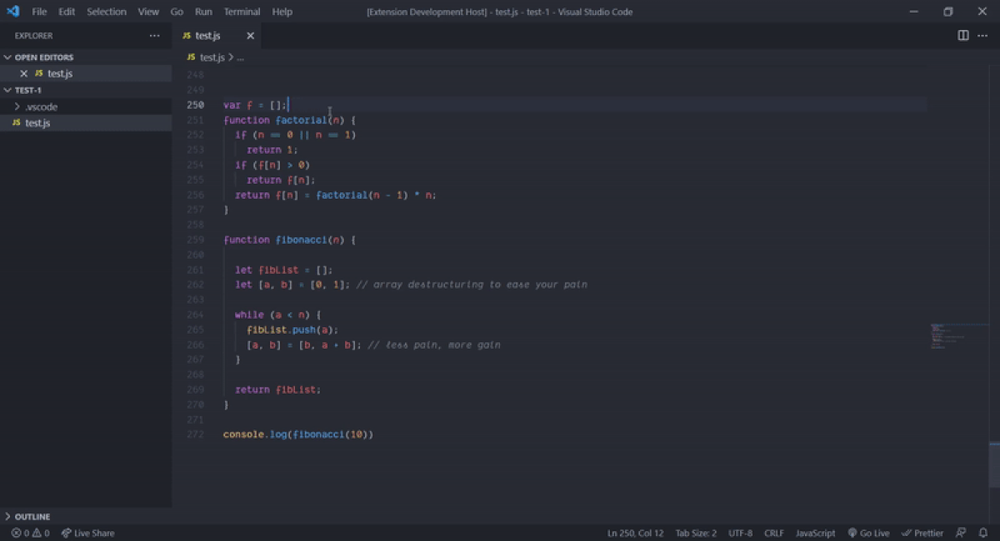

# vsc-line-jump

A Visual Studio Code extension to make relative line jumps.

## Why
Made for mouseless developers, especially helpful when working on large files, to jump into relative lines.

## Preview

